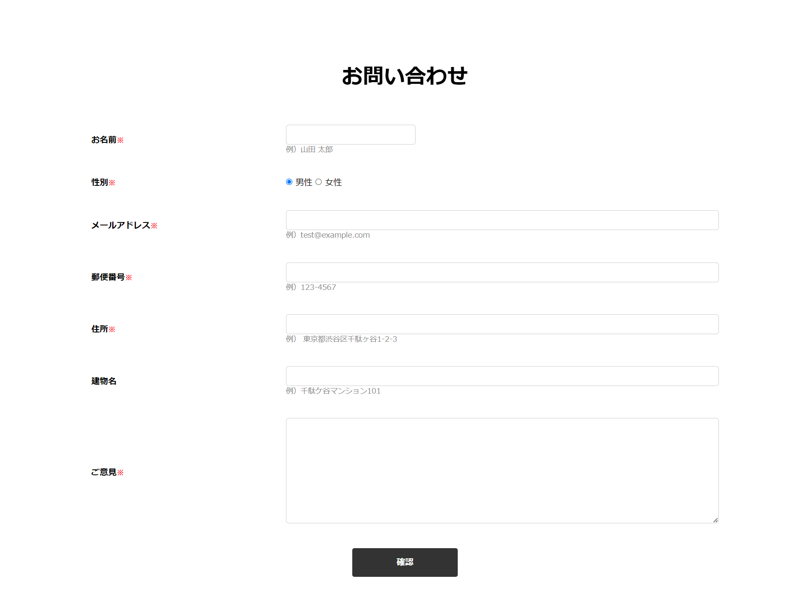
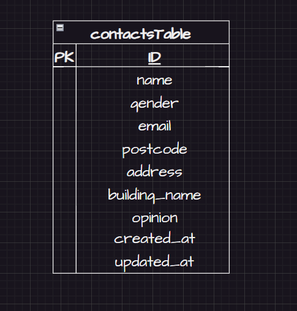

# contact-management

# 概要

このアプリケーションは、お問い合わせの管理を行うためのシステムです。  
ユーザーはお問い合わせを入力し、確認画面を経てデータが保存されます。
管理者はお問い合わせデータを検索し、削除できます。

## 作成した目的

このアプリケーションを作成した主な目的は、以下の通りです。

- ウェブサイトの訪問者が簡単にお問い合わせできるシステムを提供する。
- お問い合わせデータを効率的に管理し、管理者が必要な情報を簡単に検索できるようにする。

## アプリケーションの URL

## アプリケーションのURL
[https://github.com/yabe-shiori/contact-management.git]

注意事項:
管理者画面のログイン機能について

- name -> Admin
- email -> admin@test.com
- password -> password
  を入力し、ログインする。

## 機能一覧

- お問い合わせ入力フォーム
  - 入力データのバリデーション
- 確認画面
- データベース保存
- 管理システム画面
  - お名前、性別、登録日、メールアドレスからの検索
  - データの削除
  - 検索結果のリセット

## 使用環境

- PHP 7.4
- Laravel 8.x
- MySQL 8.0
- JavaScript

## テーブル設計

**contacts テーブル**
| Column | Type | Option |
| ------------| ------------- | ----------- |
|id |PRIMARYKEY |NOT NULL |
|name |varchar(255) |NOT NULL |
|gender | tinyint |NOT NULL |
|postcode | char(8) |NOT NULL |
| address | varchar(255) |NOT NULL |
|building_name| varchar(255) | |
| opinion | text |NOT NULL |
|created_at |timstamp | |
|updated_at |timstamp | |

## ER図

